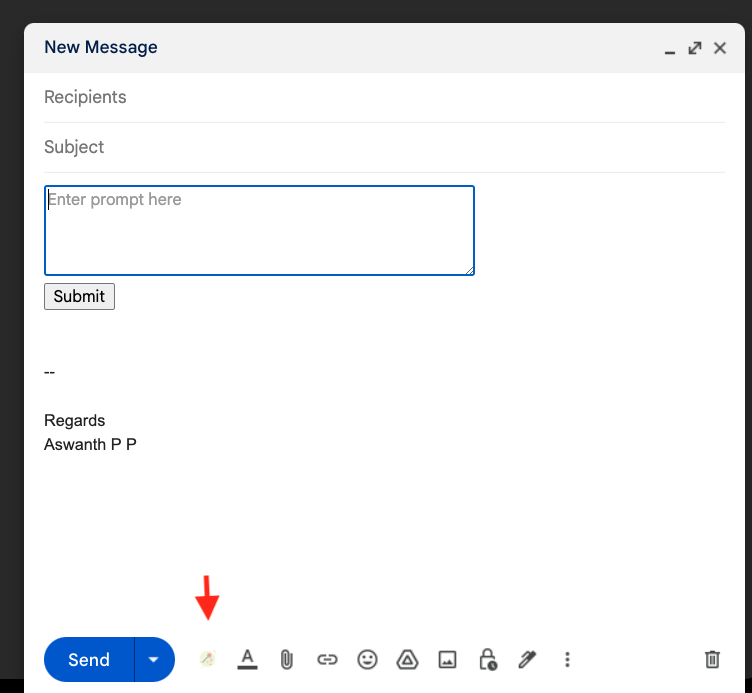

# Generate GPT Mail Response

This project aims to create Chrome extension for Gmail, to generate text for a given prompt using Open AI Completion api.

## Steps to Integrate Chrome Extension
### 1. Update Keys in keys.json
Update InBoxSDK key, Refer [Register InBox SDK](https://www.inboxsdk.com/register)
Update Open AI key, Refer [Generate Open AI Key](https://platform.openai.com/account/api-keys)
### 2. Run `npm install` to install dependencies. 
### 3. Run `npm start` to start the development server.
### 4. Add Chrome Extension
a. In Chrome, go to chrome://extensions, turn on Developer mode, click "Load unpacked", and pick the "dist" directory within this project. 
b. Open https://mail.google.com/ and click "Compose an email" at the top left. There's a button added to the Compose view!

## References:
1. InBox SDK Documentation: https://inboxsdk.github.io/inboxsdk-docs/compose/#setfromemailemail
2. OpenAI Completion API with Javascript: https://www.builder.io/blog/stream-ai-javascript
