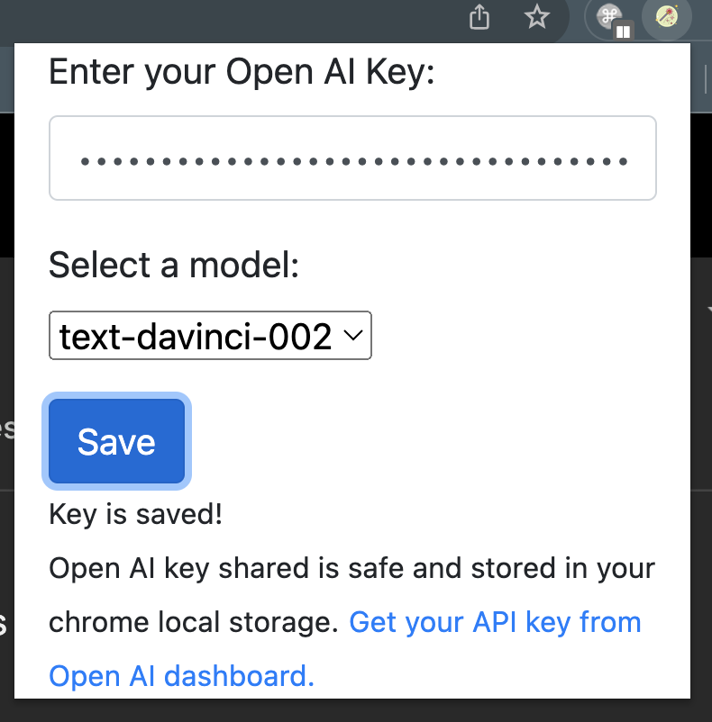

# User Guid for Generate GPT Mail

## How to Setup

1. First, click the [link](https://github.com/aswanthpp/Generate-GPT-Mail-Response/suites/17171326073/artifacts/981156072) to download the `generate-gpt-mail-extension.zip` file. Extract the .zip file to whichever location you prefer. The folder that you unzipped will need to live on your machine as long as you are using the extension.

2. Next, go to [chrome://extensions/](chrome://extensions/) in a new tab. The Extension Management page can also be opened by clicking on the Chrome menu, hovering over More Tools then selecting Extensions. When on the manage extensions page, enable 'Developer mode' by clicking the switch in the upper right corner.

3. Finally, on the [chrome://extensions/](chrome://extensions/), click the button on the upper left to "Load unpacked" and select the unzipped `generate-gpt-mail-extension` folder to install it.

## How to use

### 1. Manage Extensions

- Click the Extensions in your chrome, next to the url form in top right corner.
- Then click the `Generate GPT Mail` icon.

  

### 2. Save Open AI Key

- Get the Open AI API key from [https://platform.openai.com/account/api-keys](https://platform.openai.com/account/api-keys).
- Paste the key in the form.
- Choose the Open AI model from the dropdown.
- Click `Save`



### 3. Generate Email

#### a. Compose an Email
- Go to [mail.google.com](https://mail.google.com/mail/). Click `Compose`.
- Click the `Magic Wand` in the Gmail compose window next to `Send` button.


- Enter the prompt in the newly created form and click submit. eg:
```
Birthday wish for Alice!
```
<br><b>The GPT Response will be added as a Mail content!!.</b>

#### b. Reply to an Email
- Go to [mail.google.com](https://mail.google.com/mail/). Click `Reply` to an Existing mail thread.
- Click the `Magic Wand` in the Gmail compose window next to `Send` button.

<br><b>This will generate the reply email based on the mail conversation.</b>
